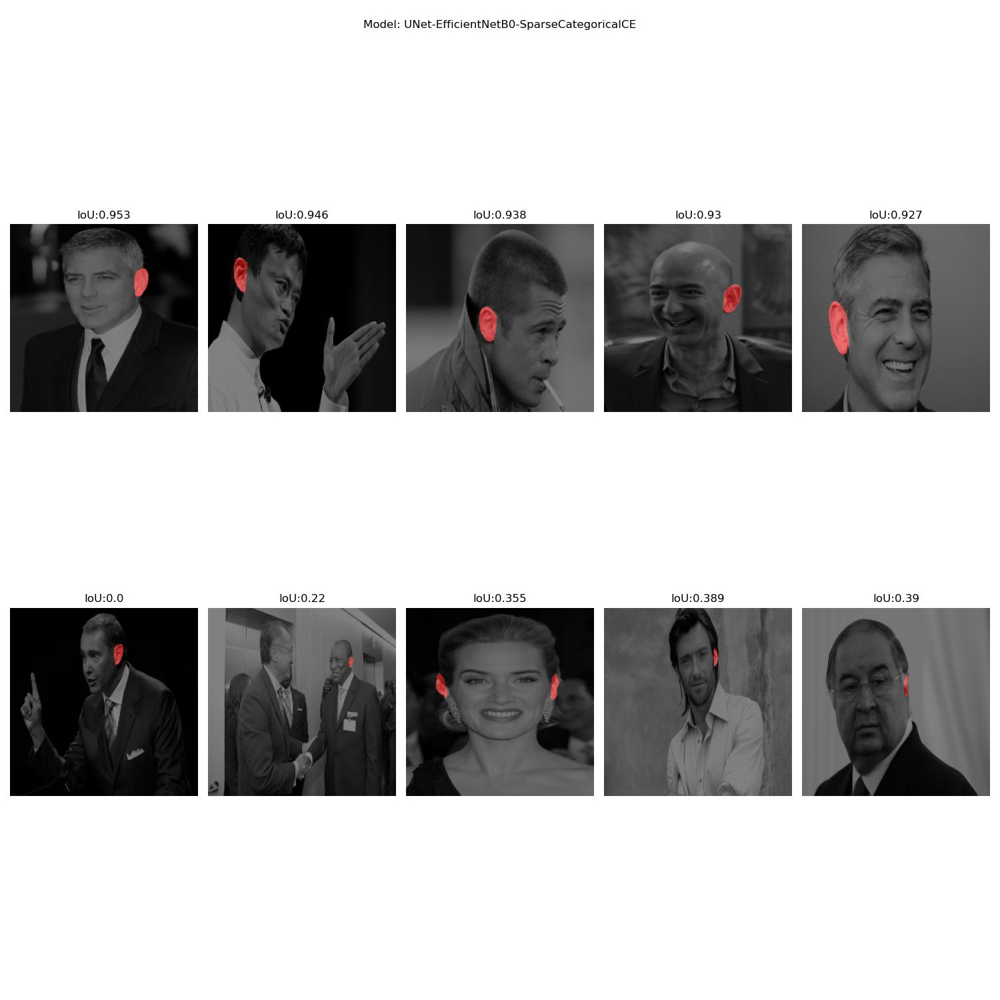
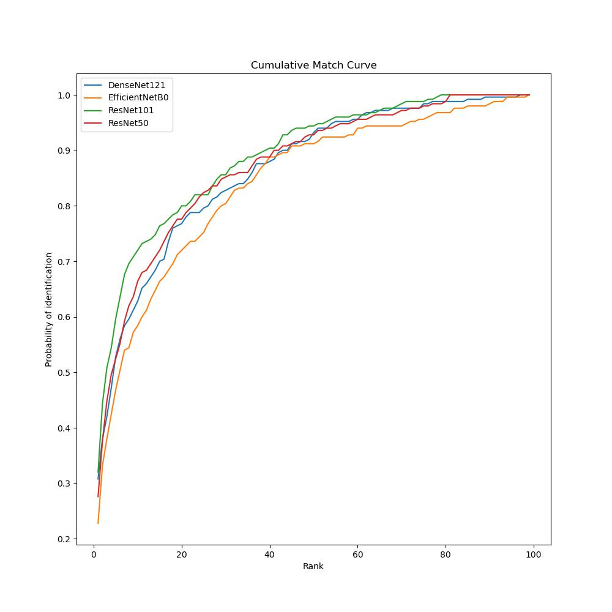

# Overview
We compare different techniques for ear detection and segmentation. We test our models on AWE-W dataset and present results. 

## Table of content
1. [**Ear Segmentation**](#earSeg)
2. [**Ear Recognition**](#earRec)

# Ear segmentation 

## Goal
The goal of the exercise is to train a model for the taks of segmenting the ears. We use AWE dataset for training and testing and try different model arhitectures/configurations to obtain good results.

## Data
We used AWE dataset which consists of 1000 images of ears from the web. Each on of them has accompanying per-pixel binary segmentation mask where 1 denotes presence of an ear.

## Preprocessing
To train deep neural networks we need large amount of data. Thus we apply preprocessing steps and make our model more robust to changes. \
We first read an image and it's segmentation mask and normalize iz between 0-1 because the models are trained on this kind of inputs. \
On training set we apply random horizontal flip, hue (factors from -0.1 to 0.1), saturation (0 to 2) and brightness (-0.2, to 0.2) adjustments. We trained a model with and without these augmentations to test, if they really help.

## Models
Mainly we trained the models with U-Net arhitecture. This is encoder-decoder CNN arhitecture where encoder is used to extract rich, deep features in the latent space, and decoder is in charge of producing final segmentation mask. We tried different backbones during training (MobileNetV2 and EfficientNetB0) which were pretrained on ImageNet dataset. We additionaly test the importance of augmentation steps where we train a model with and without them. Because the problem has big class imbalance (large difference between number of background and ear pixels in the image) we tested different loss functions. We used SparceCategorical CrossEntropy (with and without class weights) and Focal Loss. \
From the publications on this topic we also got the idea to extract face masks from images anduse this information in training as well. We used pretrained YOLOv3 model to extract face bounding boxes and generate binary masks where 1 denotes presence of the face. Here we speculated that this information would be useful to the model since the problem of finding ears can be more localized in that area. \
We also tried with DeepLabV3+ encoder decoder arhitecture which was shown to work well on this task. Is uses special ASSP (Atrous Spatial Pyramid Pooling) method which extracts larger context of the feature. Here we used ResNet-50 backbone and tried out BinaryCrossEntropy and Dice loss.

## Evaluation
We split the dataset into train (750 images) and test (250 images). Additionaly we split train data into real train (85%) and validation set (15%) to track how well our model is doing on unseen data during training.\
Models with MobileNetV2 backbone where trained for 50 epochs, others where trained for 30 because of the higher computational demands. During training we used batch size of 8. All images were resized to 224*244 before training/evaluation.

To test out models we choose different metrics:
- Accuracy: (TP+TN) / (TP+TN+FP+FN)
    - because of class imbalance it is expected to be large
- IoU: (intersection of ones) / (union of ones)
    - we took into account only ear class since this is the target class
- Precision: TP / (TP+FP)
    - how sure can we be in our predictions
- Recall: TP / (TP+FN)
    - how good our model is in detecting ground truth positives
- F1 score: (2 * precision * recall) / (precision+reacll)

## Results

Testing importance of augmentation:

| ModelName   | Accuracy    | IoU      |Precision     | Recall |  F1 score |
| ----------- | ----------- | -----------|-----------|----------- |-----------|
| UNet-MobileNetV2-FL-NoAug | 0.9979|0.6996 | 0.9133 | 0.7467 | 0.8216 |
| UNet-MobileNetV2-FL   |**0.9985** |**0.7576** |**0.9275** |**0.8045** |**0.8616**|

Results of all models:

| ModelName   | Accuracy    | IoU      |Precision     | Recall |  F1 score |
| ----------- | ----------- | -----------|-----------|----------- |-----------|
| UNet-MobileNetV2-SC   |0.9983 |0.7441 |0.9173 |0.7977 |0.8533|
| UNet-MobileNetV2-FL |0.9985|0.7576 |0.9275 |0.8045 |0.8616|
| UNet-MobileNetV2-FL-FaceMask|0.9953|0.5003 |0.8452 |0.5439|0.6619|
| UNet-EfficientNetB0-SC |**0.9990**|**0.7932**|**0.9628**|**0.8173**|**0.8841**|
| DeepLabV3+-ResNet50-D |0.9940|0.4699|0.7420|0.5634|0.6405|
| DeepLabV3+-ResNet50-BC|0.9918|0.2127|0.5913|0.2236|0.3245|

Comparison with state of the art:
| ModelName   | Accuracy    | IoU      |Precision     | Recall |  F1 score |
| ----------- | ----------- | -----------|-----------|----------- |-----------|
| UNet-EfficientNetB0-SC |**0.9990**|0.7932|**0.9628**|0.8173|**0.8841**|
| DeepLabV3+-ResNet(ContexedNet)|0.9974|**0.8146**|0.8907|**0.8747**|0.8826|
| Mask R-CNN|0.9974|0.7924|0.9204|0.8414|0.8791|

UNet arhitecture with EfficientNetB0 backbone and SparseCategorical CrossEntropy showed the best results in our testing on all metrics. Both DeepLabV3+ and Unet with EfficientNetB0 gave some errors in our training because GPU memory wasn't sufficient. So we can speculate that the results from DeepLabV3+ models aren't doing this arhitecture justic. \
Our try at a custom model with 4 channel input with original image and face mask image didn't turned out too good. We would have to try different ways of incorporating this additional information to the model so it can learn better. One way is through special fusion blocks in the decoder. One problem could also be that the bounding box of face detectors isn't always big enought to incorporate ears as well. Maybe it would be better to create a mask which would have radial gradients starting at oposite sides of bounding box. Since additional context already showed to be good for this problem, we have some room for improvement.

## Qualitative results

UNet-EfficientNetB0-SC

# Ear Recognition 
## Goal
Train a classificator that is able to recognize people based on previously segmented ears
## Approach
We used perfectly cropped ears and our own dataset for each arhitecture where all images were resized to 224x224. 15% of train dataset was used for validation. To make our models more robust we performed image augmentation on train dataset. This includes random brightness, hue and saturation changes to the images. We tested how the results change when we use and don't use augmentation.

All of the models used for transfer learning use pretrained weights (trained on ImageNet) and those weights are frozen during learning. Last layer of models is removed and connected to custom classification head made out of a flatten layer and 3 consecutive dense layers (sizes: 300, 200, 100 neurons) with dropout layer before each one (droput rate: 30%) to help with regularization. 

We trained VGG-16, ResNet50v2, ResNet101v2, DenseNet121 and EfficientNetB0 arhitectures. We trained all of them for 50 epochs with sparse categorical loss and learning rate of 0.001. After that we performed fine tunning where we lowered learning rate to 0.00001, unfroze all weights and continue training until validation loss started going up (typically for around 25 epochs).

Since CNN models without classification head can be used as feature extractors we tested this out as well. For this we used best performing models (ResNet50 and ResNet101) which were already fine tunned. We ran all images through and saved vectors from flatten layer of the network (1D feature vectors). Then we fitted scaler on train dataset and transformed both sets (train and test) so all vectors had mean=0 and std=1. Train dataset was then used for SVM model training and we tested out the performance on test set.

## Results:
For metrics we use Rank1 and Rank5 and also plot the whole CMC for visual representation and comparison between models.

<b>1. Testing augmentation importance:</b>

We use our ears dataset and ResNet101 arhitecture without fine tunning. Model with no augmentation reported good accuracy during training but validation accuracy was bad. We can see that augmentation helps with overfitting.

|Model Name | Rank1 | Rank5 |
| ----------- | ----------- | -----------|
|Augmentation | **0.272** | **0.460** |
|NoAugmentation | 0.212 | 0.424 |

<b>2. No fine tunning </b>

Here we first used already prepaired dataset where ears where perfectly cropped. All models were trained with 50 epochs, no fine tunning performed yet. 

| Model Name | Rank1 | Rank5 |
| ----------- | ----------- | -----------|
| VGG16 | 0.06 | 0.244 |
| ResNet50 | 0.28 | 0.512 |
| ResNet101 | **0.312** | **0.544** |
| DenseNet121 | 0.2 | 0.44 |
| EfficientNetB0 | 0.2 | 0.44 |

Here we used our own ears dataset. Other details stayed the same.

|Model Name | Rank1 | Rank5 |
| ----------- | ----------- | -----------|
|VGG16 | 0.048 | 0.16 |
|ResNet50 | 0.228 | **0.476** |
|ResNet101 | **0.272** | 0.46 |
|DenseNet121 | 0.164 | 0.408 |
|EfficientNetB0 | 0.172 | 0.412 |

ResNet arhitecture performed best. Our own dataset seems to be a bit more complicated for learning but this is expected because the images contain some other parts of the face (side of the face, hairs, ...) which can confuse the model.

<b>3. After fine tunning </b>

We fine tunned our best models to fit better to our problem. First we tested this on perfectly cropped ears. 

| Model Name | Rank1 | Rank5 |
| ----------- | ----------- | -----------|
| ResNet50 | 0.34 | 0.604 |
| ResNet101 | **0.352** | **0.604** |

Then this are the results where we used our own ears with fine tunning.

| Model Name | Rank1 | Rank5 |
| ----------- | ----------- | -----------|
| VGG16 | 0.032 | 0.012 |
| ResNet50 | 0.276 | 0.524 |
| ResNet101 | **0.32** | **0.596** |
| DenseNet121 | 0.308 | 0.528 |
| EfficientNetB0 | 0.228 | 0.468 |

Here also ResNet arhitecture was the best. Fine tunning substantially helped with performance.

CMC curve for our ears after fine tunning

<b>4. CNN + SVM </b>

Here we used fine tunned models as feature extractors and SVM model for final prediction. SVM model uses radial basis kernel. Here are results on perfectly cropped ears:

|Model Name | Rank1 | Rank5 |
| ----------- | ----------- | -----------|
| ResNet50 | **0.36** | **0.58** | 
|ResNet101 | 0.316 | 0.58 |

And results on our ears:

|Model Name | Rank1 | Rank5 |
| ----------- | ----------- | -----------|
|ResNet50 | 0.236 | 0.404 |
|ResNet101 | **0.3** | 0.532 |
|DenseNet121 | 0.284 | **0.568** |
|EfficientNetB0 | 0.304 | 0.516 |

Compared to results that we got without SVM classificatior we can see that they are pretty similar (for some models we see some increase, for others decrease). So there isn't a lot of benefit for using this tecnique in this problem. It looks like CNN model with custom classification head learns good enough how to differentiate between classes.

## Conclusion:

Our best model was ResNet101 after fine tunning. It achived Rank1 of 0.352 and Rank5 of 0.604 on perfectly cropped ears and Rank1 of 0.32 and Rank5 of 0.596 on our ears.  

## Literature
- Ž. Emeršič et al., "The Unconstrained Ear Recognition Challenge 2019," 2019 International Conference on Biometrics (ICB), 2019, pp. 1-15, doi: 10.1109/ICB45273.2019.8987337.
- EMERŠIČ, Žiga; ŠTRUC, Vitomir; PEER, Peter. Ear recognition: More than a survey. Neurocomputing, 2017, 255: 26-39.
- Ž. Emeršič, D. Sušanj, B. Meden, P. Peer and V. Štruc, "ContexedNet: Context–Aware Ear Detection in Unconstrained Settings," in IEEE Access, vol. 9, pp. 145175-145190, 2021, doi: 10.1109/ACCESS.2021.3121792.
- Bizjak, Matic & Peer, Peter & Emeršič, Žiga. (2019). Mask R-CNN for Ear Detection. 1624-1628. 10.23919/MIPRO.2019.8756760. 
- Ronneberger O., Fischer P., Brox T. (2015) U-Net: Convolutional Networks for Biomedical Image Segmentation. In: Navab N., Hornegger J., Wells W., Frangi A. (eds) Medical Image Computing and Computer-Assisted Intervention–MICCAI 2015. MICCAI 2015. Lecture Notes in Computer Science, vol 9351. Springer, Cham. https://doi.org/10.1007/978-3-319-24574-4_28
- Chen LC., Zhu Y., Papandreou G., Schroff F., Adam H. (2018) Encoder-Decoder with Atrous Separable Convolution for Semantic Image Segmentation. In: Ferrari V., Hebert M., Sminchisescu C., Weiss Y. (eds) Computer Vision – ECCV 2018. ECCV 2018. Lecture Notes in Computer Science, vol 11211. Springer, Cham. https://doi.org/10.1007/978-3-030-01234-2
- Sthanhng. (n.d.). Sthanhng/Yoloface: Deep learning-based face detection using the Yolov3 Algorithm (https://github.com/sthanhng/yoloface). GitHub. Retrieved December 10, 2021, from https://github.com/sthanhng/yoloface.
- Emeršič, Žiga & Štruc, Vitomir & Peer, Peter. (2017). Ear Recognition: More Than a Survey. Neurocomputing. 255. 10.1016/j.neucom.2016.08.139. 