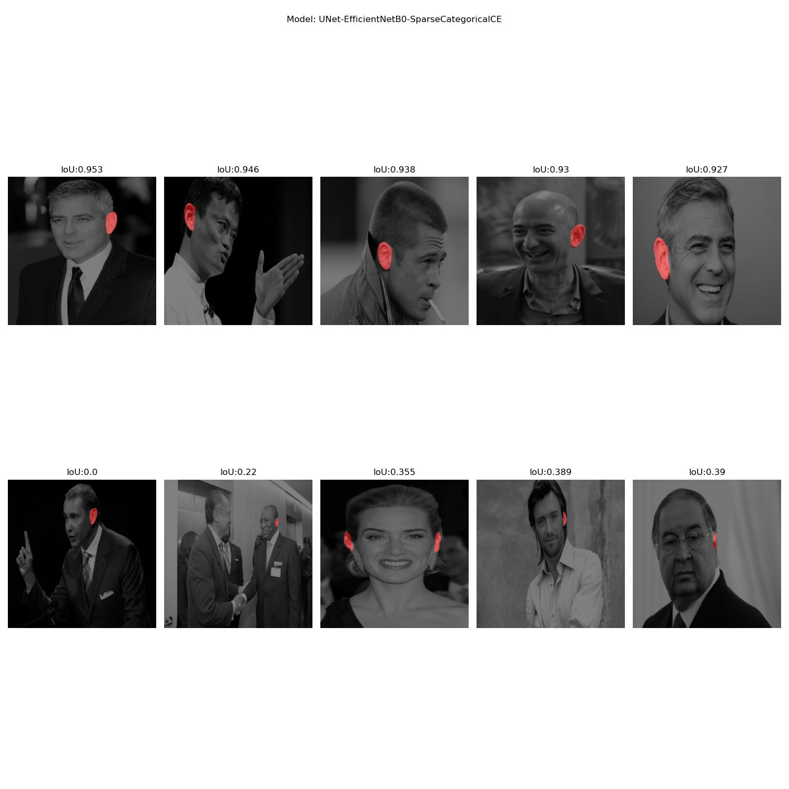
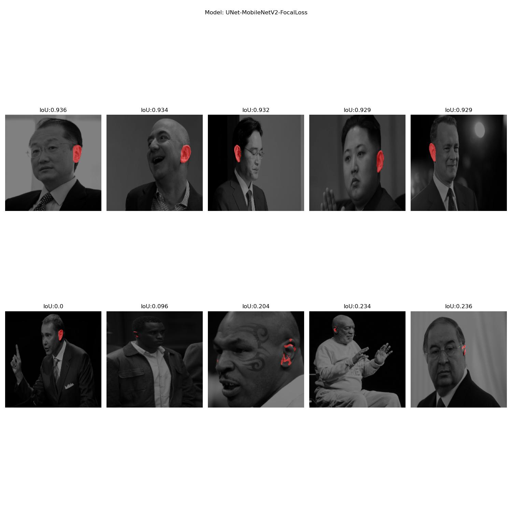
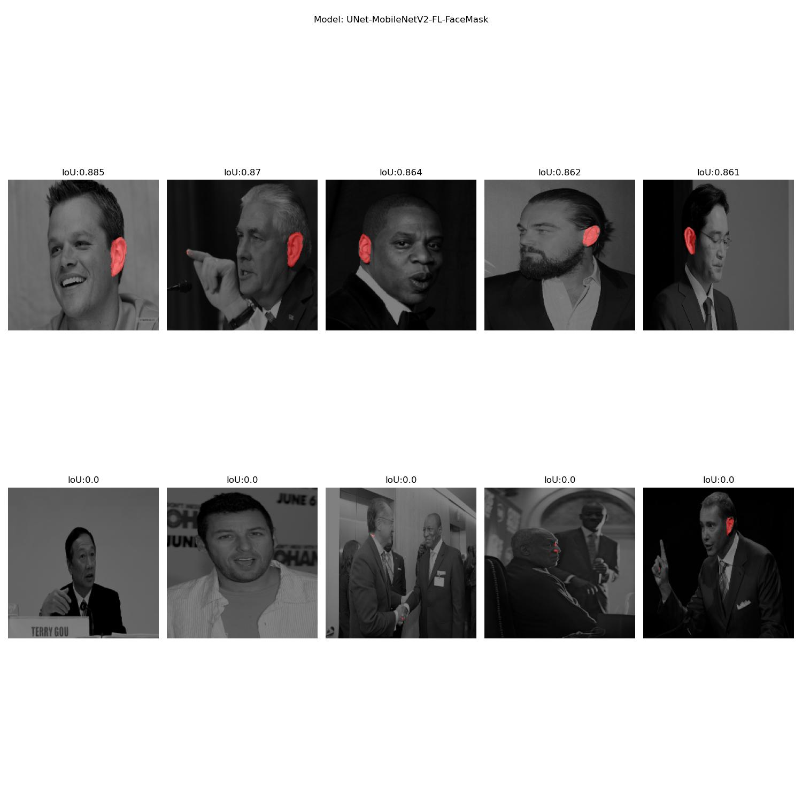

# Ear segmentation

## Goal
The goal of the exercise is to train a model for the taks of segmenting the ears. We use AWE dataset for training and testing and try different model arhitectures/configurations to obtain good results.

## Data
We used AWE dataset which consists of 1000 images of ears from the web. Each on of them has accompanying per-pixel binary segmentation mask where 1 denotes presence of an ear.

## Preprocessing
To train deep neural networks we need large amount of data. Thus we apply preprocessing steps and make our model more robust to changes. \
We first read an image and it's segmentation mask and normalize iz between 0-1 because the models are trained on this kind of inputs. \
On training set we apply random horizontal flip, hue (factors from -0.1 to 0.1), saturation (0 to 2) and brightness (-0.2, to 0.2) adjustments. We trained a model with and without these augmentations to test, if they really help.

## Models
Mainly we trained the models with U-Net arhitecture. This is encoder-decoder CNN arhitecture where encoder is used to extract rich, deep features in the latent space, and decoder is in charge of producing final segmentation mask. We tried different backbones during training (MobileNetV2 and EfficientNetB0) which were pretrained on ImageNet dataset. We additionaly test the importance of augmentation steps where we train a model with and without them. Because the problem has big class imbalance (large difference between number of background and ear pixels in the image) we tested different loss functions. We used SparceCategorical CrossEntropy (with and without class weights) and Focal Loss. \
From the publications on this topic we also got the idea to extract face masks from images anduse this information in training as well. We used pretrained YOLOv3 model to extract face bounding boxes and generate binary masks where 1 denotes presence of the face. Here we speculated that this information would be useful to the model since the problem of finding ears can be more localized in that area. \
We also tried with DeepLabV3+ encoder decoder arhitecture which was shown to work well on this task. Is uses special ASSP (Atrous Spatial Pyramid Pooling) method which extracts larger context of the feature. Here we used ResNet-50 backbone and tried out BinaryCrossEntropy and Dice loss.

## Evaluation
We split the dataset into train (750 images) and test (250 images). Additionaly we split train data into real train (85%) and validation set (15%) to track how well our model is doing on unseen data during training.\
Models with MobileNetV2 backbone where trained for 50 epochs, others where trained for 30 because of the higher computational demands. During training we used batch size of 8. All images were resized to 224*244 before training/evaluation. Example of training and validation loss during training (for model UNet-MobileNetV2):

To test out models we choose different metrics:
- Accuracy: (TP+TN) / (TP+TN+FP+FN)
    - because of class imbalance it is expected to be large
- IoU: (intersection of ones) / (union of ones)
    - we took into account only ear class since this is the target class
- Precision: TP / (TP+FP)
    - how sure can we be in our predictions
- Recall: TP / (TP+FN)
    - how good our model is in detecting ground truth positives
- F1 score: (2 * precision * recall) / (precision+reacll)

## Results

Testing importance of augmentation:

| ModelName   | Accuracy    | IoU      |Precision     | Recall |  F1 score |
| ----------- | ----------- | -----------|-----------|----------- |-----------|
| UNet-MobileNetV2-FL-NoAug | 0.9979|0.6996 | 0.9133 | 0.7467 | 0.8216 |
| UNet-MobileNetV2-FL   |**0.9985** |**0.7576** |**0.9275** |**0.8045** |**0.8616**|

Results of all models:

| ModelName   | Accuracy    | IoU      |Precision     | Recall |  F1 score |
| ----------- | ----------- | -----------|-----------|----------- |-----------|
| UNet-MobileNetV2-SC   |0.9983 |0.7441 |0.9173 |0.7977 |0.8533|
| UNet-MobileNetV2-FL |0.9985|0.7576 |0.9275 |0.8045 |0.8616|
| UNet-MobileNetV2-FL-FaceMask|0.9953|0.5003 |0.8452 |0.5439|0.6619|
| UNet-EfficientNetB0-SC |**0.9990**|**0.7932**|**0.9628**|**0.8173**|**0.8841**|
| DeepLabV3+-ResNet50-D |0.9940|0.4699|0.7420|0.5634|0.6405|
| DeepLabV3+-ResNet50-BC|0.9918|0.2127|0.5913|0.2236|0.3245|

UNet arhitecture with EfficientNetB0 backbone and SparseCategorical CrossEntropy showed the best results in our testing on all metrics. Both DeepLabV3+ and Unet with EfficientNetB0 gave some errors in our training because GPU memory wasn't sufficient. So we can speculate that the results from DeepLabV3+ models aren't doing this arhitecture justic. \
Our try at a custom model with 4 channel input with original image and face mask image didn't turned out too good. We would have to try different ways of incorporating this additional information to the model so it can learn better. One way is through special fusion blocks in the decoder. Since additional context already showed to be good for this problem, we have some room for improvement.

## Qualitative results

### UNet-EfficientNetB0-SC:

### UNet-MobileNetV2-FocalLoss:

### UNet-MobileNetV2-FL-FaceMask:

## Literature
- Ž. Emeršič et al., "The Unconstrained Ear Recognition Challenge 2019," 2019 International Conference on Biometrics (ICB), 2019, pp. 1-15, doi: 10.1109/ICB45273.2019.8987337.
- EMERŠIČ, Žiga; ŠTRUC, Vitomir; PEER, Peter. Ear recognition: More than a survey. Neurocomputing, 2017, 255: 26-39.
- Ž. Emeršič, D. Sušanj, B. Meden, P. Peer and V. Štruc, "ContexedNet: Context–Aware Ear Detection in Unconstrained Settings," in IEEE Access, vol. 9, pp. 145175-145190, 2021, doi: 10.1109/ACCESS.2021.3121792.
- Ronneberger O., Fischer P., Brox T. (2015) U-Net: Convolutional Networks for Biomedical Image Segmentation. In: Navab N., Hornegger J., Wells W., Frangi A. (eds) Medical Image Computing and Computer-Assisted Intervention–MICCAI 2015. MICCAI 2015. Lecture Notes in Computer Science, vol 9351. Springer, Cham. https://doi.org/10.1007/978-3-319-24574-4_28
- Chen LC., Zhu Y., Papandreou G., Schroff F., Adam H. (2018) Encoder-Decoder with Atrous Separable Convolution for Semantic Image Segmentation. In: Ferrari V., Hebert M., Sminchisescu C., Weiss Y. (eds) Computer Vision – ECCV 2018. ECCV 2018. Lecture Notes in Computer Science, vol 11211. Springer, Cham. https://doi.org/10.1007/978-3-030-01234-2

